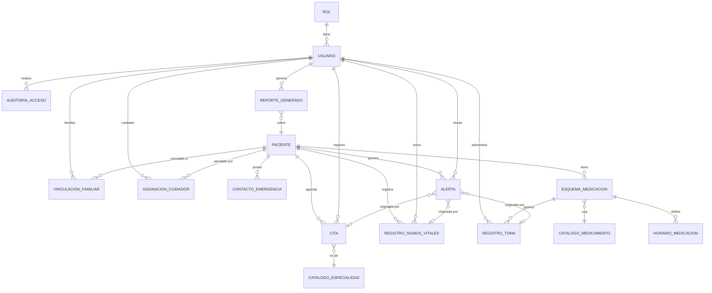

# Modelo de datos - MediTrack Senior

Diseño del esquema relacional para PostgreSQL. Fuente del dominio:
`contexto/01-proyecto.md` (el PDF `docs/definicion-proyecto.pdf` sigue **vacío,
0 bytes**, verificado al retomar esta fase). Este documento es la FASE 1
(diseño); las migraciones Flyway son la FASE 2.

## Notas de alcance

- Datos de salud sensibles (Ley 1581 de 2012): el diseño prioriza trazabilidad
  de accesos y control por rol.
- El esquema lo crea exclusivamente Flyway. Hibernate usa `ddl-auto: validate`
  y no genera ni altera tablas.
- Roles del sistema: `ADMINISTRADOR`, `CUIDADOR_ENFERMERO`, `FAMILIAR_AUTORIZADO`.
- Procesos de negocio (PDF):
  - **Proceso 1**: Perfiles y esquemas de medicación.
  - **Proceso 2**: Citas y bitácora (signos vitales).
  - **Proceso 3**: Reportes y alertas.
- **Limitación (S6):** el modelo asume **un solo centro geriátrico**. Si en el
  futuro se gestionan varios centros, habría que añadir una tabla `centro` y la
  columna `centro_id` en `paciente` y `usuario`. Hoy queda fuera de alcance.

## 1. Diagrama entidad-relación (Mermaid)

> Nota: `CATALOGO_*` son tablas de catálogo. `USUARIO` referencia a `ROL`.
> Las relaciones N:M (`VINCULACION_FAMILIAR`, `ASIGNACION_CUIDADOR`) usan tabla
> intermedia con atributos propios. `CITA.registrada_por` y
> `ALERTA.revisada_por` referencian a `USUARIO`.

## 2. Detalle de tablas

Convenciones generales:

- PK: `id BIGINT GENERATED ALWAYS AS IDENTITY` (ver decisión D1).
- Fechas: `TIMESTAMPTZ` (ver decisión D2).
- Auditoría temporal: `creado_en`, `actualizado_en` (`TIMESTAMPTZ NOT NULL`).
  **`actualizado_en` se mantiene desde la aplicación** (no con trigger), para
  que Hibernate/JPA lo controle en cada `UPDATE`; Flyway solo define el default
  inicial.
- Borrado lógico: `activo BOOLEAN NOT NULL DEFAULT true` donde aplique (D3).
- Nombres de tablas y columnas en `snake_case`.

### 2.1 `rol` (Proceso 1, transversal)

- **Propósito:** catálogo de roles del sistema.
- **Columnas:**

| Columna | Tipo | Restricciones |
| --- | --- | --- |
| `id` | BIGINT IDENTITY | PK |
| `nombre` | VARCHAR(30) | NOT NULL, UNIQUE, CHECK (`nombre IN ('ADMINISTRADOR','CUIDADOR_ENFERMERO','FAMILIAR_AUTORIZADO')`) |
| `descripcion` | VARCHAR(200) | NULL |

- **Índices:** UNIQUE sobre `nombre`.
- **Proceso:** Transversal (define permisos).

### 2.2 `usuario` (Proceso 1, transversal)

- **Propósito:** cuentas que acceden al sistema (personal y familiares).
- **Columnas:**

| Columna | Tipo | Restricciones |
| --- | --- | --- |
| `id` | BIGINT IDENTITY | PK |
| `rol_id` | BIGINT | NOT NULL, FK -> `rol(id)` ON DELETE RESTRICT |
| `nombre_completo` | VARCHAR(150) | NOT NULL |
| `correo` | VARCHAR(150) | NOT NULL, UNIQUE (índice sobre `lower(correo)`) |
| `hash_contrasena` | VARCHAR(255) | NOT NULL (hash bcrypt/argon2; NUNCA texto plano) |
| `telefono` | VARCHAR(30) | NULL |
| `activo` | BOOLEAN | NOT NULL, DEFAULT true |
| `ultimo_acceso_en` | TIMESTAMPTZ | NULL |
| `creado_en` | TIMESTAMPTZ | NOT NULL, DEFAULT now() |
| `actualizado_en` | TIMESTAMPTZ | NOT NULL, DEFAULT now() |

- **Índices:** UNIQUE case-insensitive `correo`.
- **Proceso:** P1 (gestión de usuarios), base de autenticación.

### 2.3 `paciente` (Proceso 1)

- **Propósito:** perfil del adulto mayor residente.
- **Columnas:**

| Columna | Tipo | Restricciones |
| --- | --- | --- |
| `id` | BIGINT IDENTITY | PK |
| `documento` | VARCHAR(30) | NOT NULL, UNIQUE |
| `nombres` | VARCHAR(100) | NOT NULL |
| `apellidos` | VARCHAR(100) | NOT NULL |
| `fecha_nacimiento` | DATE | NOT NULL |
| `sexo` | VARCHAR(20) | NOT NULL, CHECK (`sexo IN ('MASCULINO','FEMENINO','OTRO','NO_ESPECIFICA')`) |
| `habitacion` | VARCHAR(20) | NULL |
| `situacion_clinica` | TEXT | NULL |
| `fecha_ingreso` | DATE | NOT NULL, DEFAULT current_date |
| `activo` | BOOLEAN | NOT NULL, DEFAULT true |
| `creado_en` | TIMESTAMPTZ | NOT NULL, DEFAULT now() |
| `actualizado_en` | TIMESTAMPTZ | NOT NULL, DEFAULT now() |

- **Índices:** UNIQUE `documento`; índice en `apellidos, nombres`.
- **Proceso:** P1.
- **Nota:** la coherencia de `fecha_nacimiento` (que sea anterior a hoy) se
  valida en la aplicación, no con `CHECK`, para no atar el esquema a la fecha
  de ejecución.

### 2.4 `contacto_emergencia` (Proceso 1)

- **Propósito:** contactos de emergencia de un paciente.
- **Columnas:**

| Columna | Tipo | Restricciones |
| --- | --- | --- |
| `id` | BIGINT IDENTITY | PK |
| `paciente_id` | BIGINT | NOT NULL, FK -> `paciente(id)` ON DELETE CASCADE |
| `nombre` | VARCHAR(150) | NOT NULL |
| `parentesco` | VARCHAR(60) | NULL |
| `telefono` | VARCHAR(30) | NOT NULL |
| `es_principal` | BOOLEAN | NOT NULL, DEFAULT false |
| `creado_en` | TIMESTAMPTZ | NOT NULL, DEFAULT now() |

- **Índices:** índice en `paciente_id`; UNIQUE parcial (`paciente_id`) WHERE `es_principal`.
- **Proceso:** P1.

### 2.5 `vinculacion_familiar` (Proceso 1, N:M)

- **Propósito:** vincula un usuario FAMILIAR_AUTORIZADO con uno o varios pacientes y viceversa.
- **Columnas:**

| Columna | Tipo | Restricciones |
| --- | --- | --- |
| `id` | BIGINT IDENTITY | PK |
| `usuario_id` | BIGINT | NOT NULL, FK -> `usuario(id)` ON DELETE CASCADE |
| `paciente_id` | BIGINT | NOT NULL, FK -> `paciente(id)` ON DELETE CASCADE |
| `parentesco` | VARCHAR(60) | NULL |
| `autorizado` | BOOLEAN | NOT NULL, DEFAULT true |
| `creado_en` | TIMESTAMPTZ | NOT NULL, DEFAULT now() |

- **Índices:** UNIQUE (`usuario_id`, `paciente_id`); índice en `paciente_id`.
- **Proceso:** P1 (acceso de solo lectura del familiar).

### 2.6 `asignacion_cuidador` (Proceso 1, N:M)

- **Propósito:** vincula un usuario CUIDADOR_ENFERMERO con varios pacientes.
- **Columnas:**

| Columna | Tipo | Restricciones |
| --- | --- | --- |
| `id` | BIGINT IDENTITY | PK |
| `usuario_id` | BIGINT | NOT NULL, FK -> `usuario(id)` ON DELETE CASCADE |
| `paciente_id` | BIGINT | NOT NULL, FK -> `paciente(id)` ON DELETE CASCADE |
| `desde` | DATE | NOT NULL, DEFAULT current_date |
| `hasta` | DATE | NULL, CHECK (`hasta IS NULL OR hasta >= desde`) |
| `creado_en` | TIMESTAMPTZ | NOT NULL, DEFAULT now() |

- **Índices:** índice único parcial (`usuario_id`, `paciente_id`) WHERE `hasta IS NULL`
  (solo una asignación vigente por par); índice en `paciente_id`.
- **Proceso:** P1, P2.
### 2.7 `catalogo_medicamento` (Proceso 1)

- **Propósito:** catálogo de medicamentos.
- **Columnas:**

| Columna | Tipo | Restricciones |
| --- | --- | --- |
| `id` | BIGINT IDENTITY | PK |
| `nombre` | VARCHAR(150) | NOT NULL, UNIQUE |
| `presentacion` | VARCHAR(100) | NULL |
| `activo` | BOOLEAN | NOT NULL, DEFAULT true |

- **Índices:** UNIQUE `nombre`.
- **Proceso:** P1.

### 2.8 `esquema_medicacion` (Proceso 1)

- **Propósito:** tratamiento de un paciente con medicamento, dosis, frecuencia y vigencia.
- **Columnas:**

| Columna | Tipo | Restricciones |
| --- | --- | --- |
| `id` | BIGINT IDENTITY | PK |
| `paciente_id` | BIGINT | NOT NULL, FK -> `paciente(id)` ON DELETE RESTRICT |
| `medicamento_id` | BIGINT | NOT NULL, FK -> `catalogo_medicamento(id)` ON DELETE RESTRICT |
| `dosis` | VARCHAR(50) | NOT NULL |
| `frecuencia_horas` | SMALLINT | NOT NULL, CHECK (`frecuencia_horas BETWEEN 1 AND 24`) |
| `via` | VARCHAR(30) | NOT NULL, CHECK (`via IN ('ORAL','SUBCUTANEA','INTRAMUSCULAR','TOPICA','OTRA')`) |
| `indicaciones` | TEXT | NULL |
| `fecha_inicio` | DATE | NOT NULL |
| `fecha_fin` | DATE | NULL, CHECK (`fecha_fin IS NULL OR fecha_fin >= fecha_inicio`) |
| `activo` | BOOLEAN | NOT NULL, DEFAULT true |
| `creado_en` | TIMESTAMPTZ | NOT NULL, DEFAULT now() |
| `actualizado_en` | TIMESTAMPTZ | NOT NULL, DEFAULT now() |

- **Índices:** índice en `paciente_id`; índice en `medicamento_id`; índice parcial (`paciente_id`) WHERE `activo`.
- **Proceso:** P1.

### 2.9 `horario_medicacion` (Proceso 1)

- **Propósito:** horas exactas del día en que corresponde una toma.
- **Columnas:**

| Columna | Tipo | Restricciones |
| --- | --- | --- |
| `id` | BIGINT IDENTITY | PK |
| `esquema_id` | BIGINT | NOT NULL, FK -> `esquema_medicacion(id)` ON DELETE CASCADE |
| `hora` | TIME | NOT NULL |

- **Índices:** UNIQUE (`esquema_id`, `hora`).
- **Proceso:** P1.

### 2.10 `registro_toma` (Proceso 1)

- **Propósito:** registro de cada toma efectivamente administrada u omitida.
  Lo pendiente/atrasado se calcula desde `horario_medicacion`, no se almacena.
- **Columnas:**

| Columna | Tipo | Restricciones |
| --- | --- | --- |
| `id` | BIGINT IDENTITY | PK |
| `esquema_id` | BIGINT | NOT NULL, FK -> `esquema_medicacion(id)` ON DELETE RESTRICT |
| `registrado_por` | BIGINT | NOT NULL, FK -> `usuario(id)` ON DELETE RESTRICT |
| `fecha_hora_programada` | TIMESTAMPTZ | NOT NULL |
| `fecha_hora_registro` | TIMESTAMPTZ | NULL |
| `estado` | VARCHAR(20) | NOT NULL, CHECK (`estado IN ('ADMINISTRADA','OMITIDA')`) |
| `observaciones` | TEXT | NULL |
| `creado_en` | TIMESTAMPTZ | NOT NULL, DEFAULT now() |

- **Índices:** índice en `esquema_id`; UNIQUE (`esquema_id`, `fecha_hora_programada`);
  índice en `fecha_hora_programada`.
- **Proceso:** P1; alimenta alertas de dosis atrasada (P3).
- **Nota:** los estados `PENDIENTE` y `ATRASADA` se derivan en la capa de
  aplicación comparando `horario_medicacion` con los `registro_toma` existentes.

### 2.11 `catalogo_especialidad` (Proceso 2)

- **Propósito:** catálogo de especialidades médicas.
- **Columnas:**

| Columna | Tipo | Restricciones |
| --- | --- | --- |
| `id` | BIGINT IDENTITY | PK |
| `nombre` | VARCHAR(100) | NOT NULL, UNIQUE |

- **Índices:** UNIQUE `nombre`.
- **Proceso:** P2.

### 2.12 `cita` (Proceso 2)

- **Propósito:** agenda de citas médicas de un paciente.
- **Columnas:**

| Columna | Tipo | Restricciones |
| --- | --- | --- |
| `id` | BIGINT IDENTITY | PK |
| `paciente_id` | BIGINT | NOT NULL, FK -> `paciente(id)` ON DELETE RESTRICT |
| `especialidad_id` | BIGINT | NULL, FK -> `catalogo_especialidad(id)` ON DELETE RESTRICT |
| `registrada_por` | BIGINT | NOT NULL, FK -> `usuario(id)` ON DELETE RESTRICT |
| `profesional` | VARCHAR(150) | NULL |
| `fecha_hora` | TIMESTAMPTZ | NOT NULL |
| `lugar` | VARCHAR(150) | NULL |
| `motivo` | TEXT | NULL |
| `estado` | VARCHAR(20) | NOT NULL, CHECK (`estado IN ('PROGRAMADA','CUMPLIDA','INCUMPLIDA','CANCELADA','REPROGRAMADA')`) |
| `creado_en` | TIMESTAMPTZ | NOT NULL, DEFAULT now() |
| `actualizado_en` | TIMESTAMPTZ | NOT NULL, DEFAULT now() |

- **Índices:** índice en `paciente_id`; índice en `fecha_hora`; índice en `estado`.
- **Proceso:** P2; alimenta alertas de cita próxima y KPI de citas cumplidas/incumplidas (P3).

### 2.13 `registro_signos_vitales` (Proceso 2, bitácora)

- **Propósito:** bitácora de signos vitales por paciente.
- **Columnas:**

| Columna | Tipo | Restricciones |
| --- | --- | --- |
| `id` | BIGINT IDENTITY | PK |
| `paciente_id` | BIGINT | NOT NULL, FK -> `paciente(id)` ON DELETE RESTRICT |
| `registrado_por` | BIGINT | NOT NULL, FK -> `usuario(id)` ON DELETE RESTRICT |
| `fecha_hora` | TIMESTAMPTZ | NOT NULL, DEFAULT now() |
| `presion_sistolica` | SMALLINT | NULL, CHECK (`BETWEEN 50 AND 300`) |
| `presion_diastolica` | SMALLINT | NULL, CHECK (`BETWEEN 30 AND 200`) |
| `glucosa_mg_dl` | SMALLINT | NULL, CHECK (`BETWEEN 20 AND 800`) |
| `temperatura_c` | NUMERIC(4,1) | NULL, CHECK (`BETWEEN 30.0 AND 45.0`) |
| `observaciones` | TEXT | NULL |
| `creado_en` | TIMESTAMPTZ | NOT NULL, DEFAULT now() |

- **Restricción adicional:** CHECK de coherencia `presion_diastolica < presion_sistolica` cuando ambas no son nulas.
- **Índices:** índice en `paciente_id, fecha_hora`.
- **Proceso:** P2; alimenta alertas por valores fuera de rango (P3).

### 2.14 `alerta` (Proceso 3)

- **Propósito:** alertas operativas generadas por el sistema o el personal.
- **Columnas:**

| Columna | Tipo | Restricciones |
| --- | --- | --- |
| `id` | BIGINT IDENTITY | PK |
| `paciente_id` | BIGINT | NOT NULL, FK -> `paciente(id)` ON DELETE RESTRICT |
| `tipo` | VARCHAR(40) | NOT NULL, CHECK (`tipo IN ('DOSIS_ATRASADA','BITACORA_INCOMPLETA','SIGNO_FUERA_DE_RANGO','CITA_PROXIMA','OTRA')`) |
| `severidad` | VARCHAR(10) | NOT NULL, CHECK (`severidad IN ('ALTA','MEDIA','INFO')`) |
| `mensaje` | TEXT | NOT NULL |
| `origen` | VARCHAR(20) | NOT NULL, CHECK (`origen IN ('SISTEMA','USUARIO')`) |
| `signos_id` | BIGINT | NULL, FK -> `registro_signos_vitales(id)` ON DELETE RESTRICT |
| `toma_id` | BIGINT | NULL, FK -> `registro_toma(id)` ON DELETE RESTRICT |
| `cita_id` | BIGINT | NULL, FK -> `cita(id)` ON DELETE RESTRICT |
| `estado` | VARCHAR(20) | NOT NULL, DEFAULT 'ACTIVA', CHECK (`estado IN ('ACTIVA','REVISADA','DESCARTADA')`) |
| `creado_en` | TIMESTAMPTZ | NOT NULL, DEFAULT now() |
| `revisada_en` | TIMESTAMPTZ | NULL |
| `revisada_por` | BIGINT | NULL, FK -> `usuario(id)` ON DELETE RESTRICT |

- **Índices:** índice en `paciente_id, estado`; índice en `severidad`; índice en `creado_en`.
- **Índices únicos parciales para idempotencia del scheduler:**
  - UNIQUE parcial (`toma_id`) WHERE `toma_id IS NOT NULL`.
  - UNIQUE parcial (`cita_id`) WHERE `cita_id IS NOT NULL`.
  - UNIQUE parcial (`signos_id`) WHERE `signos_id IS NOT NULL`.
  Así, una misma fuente (una toma, una cita o un registro de signos) no genera
  dos veces la misma alerta, aunque el job se ejecute repetidamente.
- **CHECK de fuente única:** a lo sumo una de las tres fuentes informada:
  `(CASE WHEN toma_id IS NOT NULL THEN 1 ELSE 0 END + CASE WHEN cita_id IS NOT NULL THEN 1 ELSE 0 END + CASE WHEN signos_id IS NOT NULL THEN 1 ELSE 0 END) <= 1`.
- **Proceso:** P3.

### 2.15 `reporte_generado` (Proceso 3, S1)

- **Propósito:** metadatos de los reportes clínicos generados. **No almacena el
  archivo** (solo su descripción y puntero lógico).
- **Columnas:**

| Columna | Tipo | Restricciones |
| --- | --- | --- |
| `id` | BIGINT IDENTITY | PK |
| `paciente_id` | BIGINT | NOT NULL, FK -> `paciente(id)` ON DELETE RESTRICT |
| `generado_por` | BIGINT | NOT NULL, FK -> `usuario(id)` ON DELETE RESTRICT |
| `tipo` | VARCHAR(40) | NOT NULL, CHECK (`tipo IN ('HISTORIA_CLINICA','BITACORA','MEDICACION','GENERAL')`) |
| `rango_desde` | TIMESTAMPTZ | NULL |
| `rango_hasta` | TIMESTAMPTZ | NULL |
| `ruta_almacenamiento` | VARCHAR(300) | NULL (puntero lógico; no contiene el archivo) |
| `creado_en` | TIMESTAMPTZ | NOT NULL, DEFAULT now() |

- **Índices:** índice en `paciente_id`; índice en `creado_en` (KPI "Reportes generados").
- **Proceso:** P3.

### 2.16 `auditoria_acceso` (Transversal, Ley 1581)

- **Propósito:** trazabilidad de accesos y operaciones sensibles: acceso a
  **datos clínicos**, **login/logout** y **gestión de usuarios y roles**.
- **Naturaleza:** tabla **solo de inserción** (append-only). No se actualiza ni
  se borra desde la aplicación.
- **Columnas:**

| Columna | Tipo | Restricciones |
| --- | --- | --- |
| `id` | BIGINT IDENTITY | PK |
| `usuario_id` | BIGINT | NULL, FK -> `usuario(id)` ON DELETE RESTRICT |
| `accion` | VARCHAR(20) | NOT NULL, CHECK (`accion IN ('CREATE','READ','UPDATE','DELETE','LOGIN','LOGOUT')`) |
| `entidad` | VARCHAR(60) | NOT NULL |
| `entidad_id` | BIGINT | NULL |
| `fecha_hora` | TIMESTAMPTZ | NOT NULL, DEFAULT now() |
| `resultado` | VARCHAR(20) | NOT NULL, CHECK (`resultado IN ('EXITOSO','DENEGADO')`) |
| `detalle` | TEXT | NULL |

- **Índices:** índice en `usuario_id, fecha_hora`; índice en `entidad, entidad_id`.
- **Proceso:** Transversal (cumplimiento Ley 1581).
## 3. Decisiones de diseño justificadas

### D1. Tipo de PK: BIGINT IDENTITY (no UUID)

- **Decisión:** `BIGINT GENERATED ALWAYS AS IDENTITY`.
- **Justificación:** monolito modular con una sola base PostgreSQL; los
  identificadores no se exponen entre servicios. BIGINT es más compacto
  (8 vs 16 bytes) y mejor para índices y FK; el orden secuencial favorece la
  localidad de páginas.
- **Contrapartida:** UUID ganaría si hubiera que fusionar datos entre nodos o
  exponer IDs opacos sin revelar volumen. No es el caso hoy.

### D2. Fechas con TIMESTAMPTZ

- **Decisión:** los instantes usan `TIMESTAMPTZ`; fechas sin hora (nacimiento,
  ingreso, vigencia) usan `DATE`; horas del día (horarios) usan `TIME`.
- **Justificación:** la app puede desplegarse en Azure (UTC) mientras el centro
  opera en hora de Colombia (UTC-5). `TIMESTAMPTZ` guarda UTC y evita
  ambigüedad al calcular "dosis atrasada" o "cita próxima".

### D3. Borrado lógico en maestras; físico solo en dependientes puras

- **Decisión:** las maestras (`usuario`, `paciente`, `catalogo_medicamento`,
  `esquema_medicacion`, `cita` vía `estado`) usan borrado lógico. Los
  movimientos clínicos (`registro_signos_vitales`, `registro_toma`,
  `auditoria_acceso`, `reporte_generado`) no se borran físicamente. Las
  dependientes puras (`contacto_emergencia`, `horario_medicacion`) usan
  `ON DELETE CASCADE`. **Todas las FK desde `paciente`** hacia movimientos
  (`registro_signos_vitales`, `cita`, `esquema_medicacion`, `alerta`,
  `registro_toma`, `reporte_generado`) usan **RESTRICT**, para que un paciente
  con historial no se pueda borrar por accidente.
- **Justificación:** trazabilidad (Ley 1581) y conservación del historial
  clínico.

### D4. Rangos válidos de signos vitales con CHECK

- **Decisión:** `CHECK` de rango fisiológico plausible en cada signo (ver 2.13):
  sistólica 50-300, diastólica 30-200, glucosa 20-800 y temperatura 30,0-45,0.
- **Justificación:** evita errores de digitación groseros (por ejemplo,
  temperatura 365 en vez de 36,5) sin impedir valores reales extremos. El rango
  clínico "normal" (que dispara alertas) es una regla de negocio de la capa de
  aplicación, no del esquema.

### D5. Enums como VARCHAR + CHECK (no tipo ENUM nativo)

- **Decisión:** valores enumerados como `VARCHAR` con `CHECK`.
- **Justificación:** cambiar un `ENUM` nativo requiere `ALTER TYPE` incómodo en
  Flyway; con `VARCHAR + CHECK` el cambio es un `DROP/ADD CONSTRAINT` claro y
  versionable. Hibernate mapea `VARCHAR` a String/enum de Java sin fricción.
  Los catálogos con filas propias (medicamentos, especialidades, roles) son
  tablas de catálogo, no enums.

### D6. Modelado del esquema de medicación

- **Decisión:** `catalogo_medicamento` (qué se receta) se separa de
  `esquema_medicacion` (receta de un paciente: dosis, frecuencia, vía,
  vigencia), de `horario_medicacion` (horas del día) y de `registro_toma`.
- **Justificación:** reutilizar el catálogo evita duplicados; `frecuencia_horas`
  expresa la pauta y `horario_medicacion` materializa las horas exactas
  necesarias para las tareas del día y las alertas de atraso; `registro_toma`
  guarda cada evento con hora programada y real. UNIQUE (`esquema_id`,
  `fecha_hora_programada`) evita doble registro. Los estados `PENDIENTE` y
  `ATRASADA` no se almacenan: se derivan de `horario_medicacion`.
- **Alternativa descartada:** un campo de texto libre (no permite calcular ni
  alertar).

### D7. `actualizado_en` gestionado por la aplicación

- **Decisión:** no se usan triggers de base de datos para `actualizado_en`.
- **Justificación:** el valor lo fija JPA/Hibernate en cada `UPDATE`, lo que
  mantiene una única fuente de verdad en la aplicación y evita lógica duplicada
  en el motor. Flyway solo define el `DEFAULT now()` para la inserción.

### D8. `auditoria_acceso` append-only

- **Decisión:** tabla de solo inserción para acceso a datos clínicos,
  login/logout y gestión de usuarios/roles.
- **Justificación:** garantizar inmutabilidad de la trazabilidad exigida por la
  Ley 1581.

## 4. Tablas esperadas vs. resultado

| Esperada | Estado | Nota |
| --- | --- | --- |
| `usuario` | Sí | + `rol_id`, hash de contraseña |
| `rol` | Sí | catálogo con CHECK |
| `paciente` | Sí | + `documento` único, `situacion_clinica` |
| `contacto_emergencia` | Sí | + `es_principal` |
| `vinculacion_familiar` | Sí | N:M usuario-paciente |
| `asignacion_cuidador` | Sí | N:M cuidador-paciente; único parcial mientras vigente |
| `esquema_medicacion` | Sí | + `catalogo_medicamento` |
| `registro_toma` | Sí | + `horario_medicacion` |
| `cita` | Sí | + `catalogo_especialidad`, `registrada_por` |
| `registro_signos_vitales` | Sí | + CHECK de rangos |
| `alerta` | Sí | + `origen`, FKs a la fuente, únicos parciales idempotentes |
| `auditoria_acceso` | Sí | trazabilidad Ley 1581 (append-only) |
| `reporte_generado` | Sí (S1) | solo metadatos, sin archivo |
| **Agregadas** | `catalogo_medicamento`, `catalogo_especialidad`, `horario_medicacion` | Justificadas en D5/D6 |

## 5. Trazabilidad: KPI del PDF -> tablas/columnas

| KPI (dashboard) | Cómo se calcula | Tablas/columnas |
| --- | --- | --- |
| **Citas cumplidas (%)** | citas `CUMPLIDA` / total del periodo | `cita.estado`, `cita.fecha_hora` |
| **Bitácoras registradas (%)** | pacientes con >=1 registro hoy / activos | `registro_signos_vitales.fecha_hora`, `paciente.activo` |
| **Tiempo de alerta (promedio)** | `revisada_en - creado_en` | `alerta.creado_en`, `alerta.revisada_en` |
| **Reportes generados** | conteo de filas en el periodo | `reporte_generado.creado_en` |
| **Alertas activas** | conteo estado `ACTIVA` | `alerta.estado`, `alerta.severidad` |
| **Cumplimiento de medicación (%)** | tomas `ADMINISTRADA` / tomas programadas | `registro_toma.estado`, `registro_toma.fecha_hora_programada` |
| **Alertas por dosis atrasada** | alertas `DOSIS_ATRASADA` | `alerta.tipo`, `alerta.creado_en` |
| **Tiempo de registro de perfil** | `paciente.actualizado_en - paciente.creado_en`; mide cuánto tarda un perfil desde su creación hasta su completitud/última edición | `paciente.creado_en`, `paciente.actualizado_en` |
| **% de esquemas configurados sin errores** | **queda fuera de la BD**: no hay "errores" persistidos. Se propone medir en la app como esquemas activos con al menos un `horario_medicacion` y `frecuencia_horas` coherente / total de esquemas activos | `esquema_medicacion`, `horario_medicacion` (parcial) |

## 6. Dudas y supuestos resueltos

- **S1 (resuelto):** se agrega `reporte_generado` (solo metadatos, sin archivo).
- **S2 (resuelto):** las migraciones NO incluyen códigos de tarea Jira.
- **S3 (resuelto):** se retiran `saturacion_o2` y `frecuencia_cardiaca`.
- **S4 (resuelto):** `auditoria_acceso` cubre datos clínicos, login/logout y
  gestión de usuarios y roles; es append-only.
- **S5 (resuelto):** `V3` solo siembra roles y especialidades básicas. El
  administrador inicial NO se siembra en SQL: lo creará un `ApplicationRunner`
  idempotente en el paso de seguridad (basado en `ADMIN_INITIAL_PASSWORD`).
- **S6 (resuelto):** un solo centro geriátrico; documentado como limitación.

### Supuestos restantes

- **SR1:** `sexo = 'NO_ESPECIFICA'` cubre el caso no informado. Si se requiere
  `NULL`, indicarlo.
- **SR2:** `via` de administración se limita a las cinco opciones del CHECK;
  se puede ampliar con una migración si aparece otra vía.